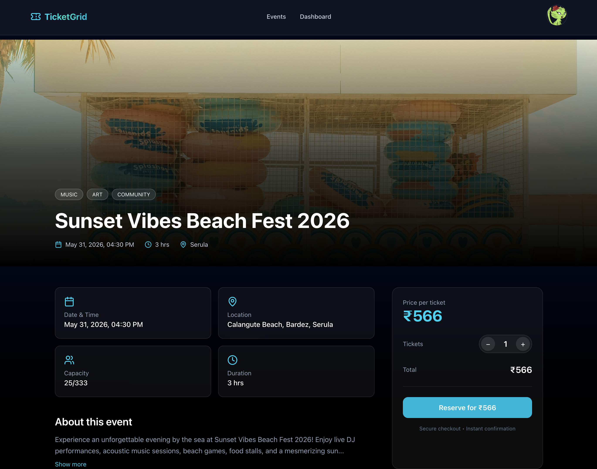
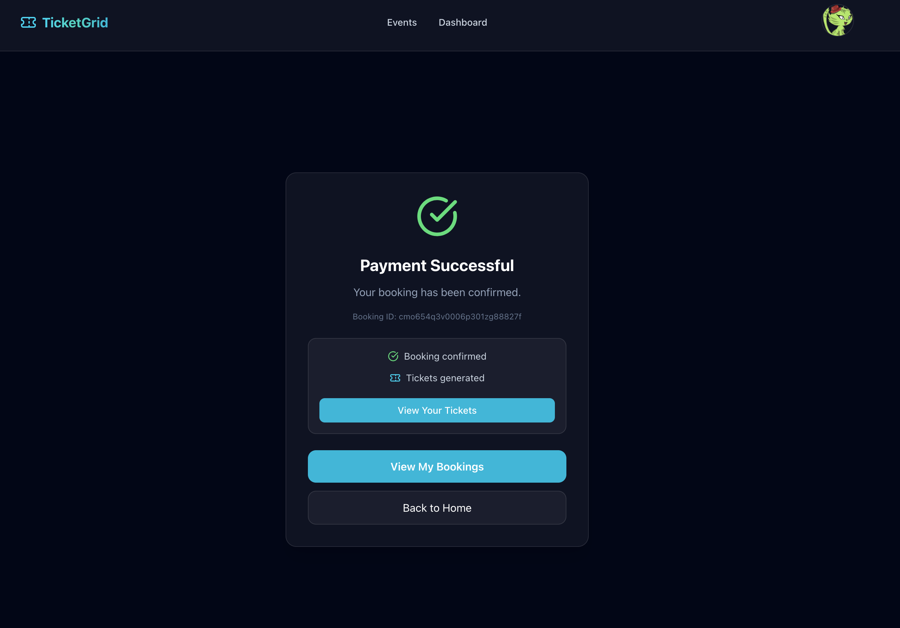

# 🎟️ TicketGrid

**A scalable, production-ready event booking platform with secure payments, QR tickets, and distributed backend architecture.**

🌐 **Live Demo:** https://ticketgrid.xyz
⚙️ **API:** https://api.ticketgrid.xyz

---

## 🚀 Features

✨ Create and manage events
🎫 Book tickets with real-time availability
💳 Secure payments via Stripe
📩 Automated email confirmations
📦 Background job processing (RabbitMQ)
🔐 QR-based ticket generation
⚡ Fault-tolerant payment workflow

---

## 🏗️ Architecture

TicketGrid follows a **distributed system design** to ensure scalability and reliability.

```
Frontend (Next.js - Vercel)
        ↓
API (Node.js + Express - EC2)
        ↓
----------------------------------
| PostgreSQL | MongoDB | Redis |
----------------------------------
        ↓
RabbitMQ Queue → Worker Service
        ↓
Email / Payment Processing
```

---

## ⚙️ Tech Stack

**Frontend:** Next.js, React
**Backend:** Node.js, Express, Prisma
**Databases:** PostgreSQL, MongoDB
**Cache:** Redis
**Queue System:** RabbitMQ
**Payments:** Stripe API + Webhooks
**DevOps:** Docker, AWS EC2, Nginx, SSL (Let's Encrypt)

---

## 🚀 Deployment

* 🐳 Dockerized multi-service architecture
* ☁️ Deployed on AWS EC2
* 🔁 Nginx reverse proxy
* 🔒 HTTPS secured with Let's Encrypt

---

## 📸 Screenshots

### 🏠 Homepage


### 🎟️ Event Page



### 💳 payment



---

## 🔐 Key Highlights

* Event-driven architecture using RabbitMQ
* Idempotent Stripe webhook handling
* Production-grade deployment with Docker + Nginx
* Scalable backend with async workers
* Real-world payment system integration

---

## 🧪 Running Locally

```bash
git clone https://github.com/ayush844/TicketGrid.git
cd TicketGrid

# start all services
docker-compose up --build
```

---

## 📬 Contact

If you liked this project or want to collaborate, feel free to reach out:

💼 LinkedIn: [https://linkedin.com/in/your-username](https://www.linkedin.com/in/ayush-sharma-217335250/)
💻 GitHub: [https://github.com/ayush844](https://github.com/ayush844)
📧 Email: ayush.xyz1625@gmail.com

---

⭐ If you found this helpful, consider giving it a star!
